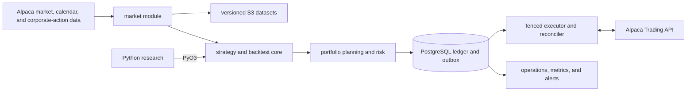

# Target architecture

This document defines the intended end state. It is not a claim that every
component exists; see [IMPLEMENTATION_STATUS.md](IMPLEMENTATION_STATUS.md) for
the verified implementation boundary.

## System shape

Production is one Rust modular-monolith process. Internal modules communicate
through typed domain contracts; they are not independently deployed services.
Python research loads the same compiled Rust strategy, backtest, sizing, and
risk core through PyO3. Python may orchestrate experiments and analyze outputs,
but may not reimplement a trading decision or access live credentials.

## Module boundaries

- `market`: calendar and clock, historical/live ingestion, provenance,
  corrections, corporate actions, and freshness. It exposes completed,
  availability-safe observations; it never decides what to buy.
- `strategy`: released signal logic. It consumes a decision snapshot and emits a
  broker-neutral target portfolio. It cannot import execution adapters.
- `backtest`: deterministic event replay through the production strategy,
  sizing, cost, and risk path with injected time and seeded randomness.
- `risk`: cash, exposure, whole-share sizing, liquidity, price bands, loss and
  drawdown limits, account restrictions, release authority, and activation
  gates. It emits explicit approve/reduce/reject outcomes.
- `execution`: durable intents, Alpaca adapter, order state machine, partial
  fills, cancellation/replacement, broker protection, ambiguous outcome
  recovery, and reconciliation. This is the only broker mutation boundary.
- `operations`: startup authority, lease/fence, health, modes, kill state,
  metrics, audit export, and operator CLI.
- `research`: Python experiment orchestration and statistical evaluation. It is
  outside the production authority boundary.

Compile-time dependency direction is `market -> domain`, `strategy -> domain`,
`backtest -> domain/strategy/risk`, `risk -> domain`, `execution ->
domain/risk`, and `operations/app -> all`. Domain and strategy do not depend on
execution or infrastructure.

## Durable workflow

1. Startup is disabled and reconcile-only.
2. The process verifies environment, account fingerprint, release digest,
   activation permit, kill state, database authority, data freshness, and the
   fixed broker host.
3. It acquires a PostgreSQL lease carrying a monotonically increasing fencing
   token. Loss of the lease immediately removes submission authority.
4. Reconciliation compares broker orders, fills, positions, and cash with local
   projections. Any unexplained difference holds execution.
5. A completed decision snapshot produces a deterministic target portfolio and
   risk decision.
6. An order intent and outbox event commit in one transaction before network
   submission. Its client order ID is deterministic and unique.
7. A timeout or lost response becomes `SUBMISSION_UNKNOWN`; reconciliation looks
   up that client order ID and never blindly resubmits.
8. Broker events append before projections change. Only fill events change cash,
   positions, and P&L.

## Runtime modes

- `read_only`: ingest and reconcile without broker mutation; every deployment
  starts here.
- `shadow`: run production decisions but emit no broker intent.
- `paper`: allow orders only against the fixed paper host and paper account.
- `live`: allow orders only against the fixed live host after all live gates.
- `reconcile_only`: freeze decisions/submissions while resolving broker truth.
- `soft_halt`: block new exposure while allowing defined protective actions.
- `hard_halt`: cancel known entry orders, preserve protection, and require human
  clearance; never blindly flatten uncertain state.
- `controlled_liquidation`: separately authorized bounded reduction after a
  successful reconciliation.

## Infrastructure

Each environment is an independent Terraform root deployment. ECS/Fargate runs
one on-demand task with stop-before-start deployment semantics and no inbound
network path. RDS PostgreSQL is durable authority. S3 stores immutable datasets,
signed releases, and audits. ECR stores immutable images. Secrets Manager and
KMS protect credentials. CloudWatch, SNS, EventBridge, and a credential-free
dead-man Lambda provide observability.

Paper uses Single-AZ RDS with seven-day recovery. Live uses Multi-AZ, deletion
protection, 35-day recovery, two NAT gateways, and two availability zones. The
live topology remains single-active; future warm standby must be fenced and
execution-disabled until reconciled promotion.

## Service objectives

- 99.9% internal availability during scheduled trading windows.
- Broker events persisted within 250 ms p99 of arrival.
- Healthy decision-to-submit processing within 500 ms p99, excluding broker
  latency.
- Reconciliation/recovery within five minutes.

Missing an objective causes a safe skip or halt, never a rushed order.
